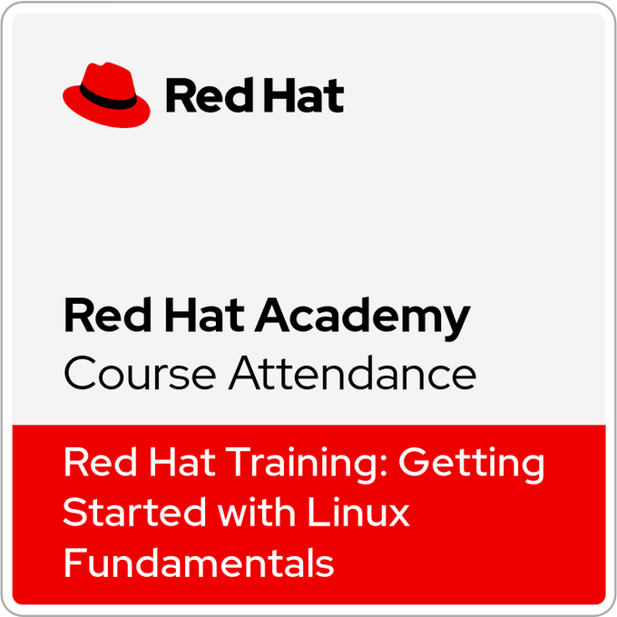
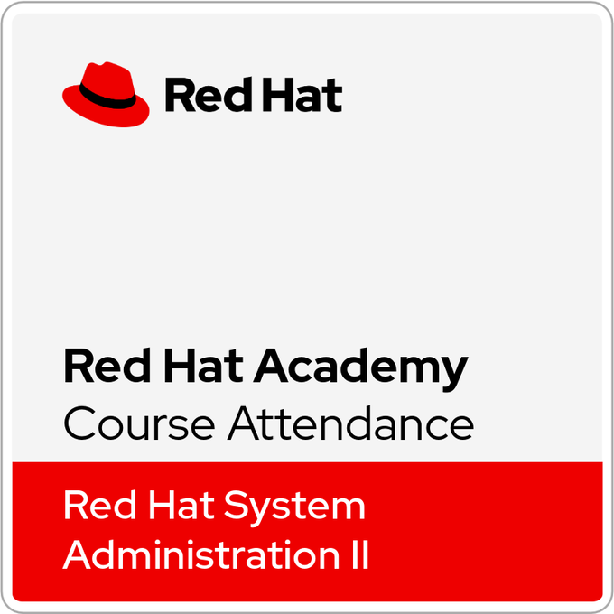

# 👋 Hi, I'm Ahmed Elghachi

---
## 🛡️ About Me

Cybersecurity Master's student specializing in Cyber Defense and Information Systems, focused on Blue Team operations including threat detection, log analysis, and incident response. Hands-on experience with SOC environments, working with tools like Wazuh for monitoring and security event analysis. Skilled in SOC operations with AWS-based projects, including threat detection, log analysis, and incident response, as well as cloud security (AWS), network administration, and system hardening. Passionate about building practical security solutions, performing vulnerability assessments, and improving defensive security strategies.

---
## 📜 Certifications

 
🏅 Ethical Hacker – Cisco

  

 
🏅 AWS Academy Cloud Foundations

  

 
🏅 CCNA ITN

  

 
🏅 CCNA SRWE

  

 
🏅 CCNA ENSA

  

 
🏅 Red Hat Fundamentals

  

 
🏅 Red Hat Administration II

---

## ⚒️ Skills

---

## 🚀 Projects

|  Project |  Description |  Skills |  Link |
|-----------|--------------|-----------|--------|
| ☁️ AWS Academy Cloud Foundations | AWS training badge validating foundational knowledge of cloud computing, AWS core services, architecture, pricing, and support. | Cloud Computing • AWS • IAM • EC2 • S3 • VPC • Cloud Security • Networking • Monitoring • Cost Management | [View Repository](https://github.com/Ahmed-Elghachi/AWS-Academy-Cloud-Foundations) |
| 🛡️ AWS Academy Cloud Security Foundations | Hands-on training focused on AWS cloud security, including identity and access management, data protection, network security, and monitoring best practices. | AWS Security • IAM • KMS • CloudTrail • CloudWatch • VPC Security • Encryption • Threat Detection | [View Repository](https://github.com/Ahmed-Elghachi/AWS-Cloud-Security-Foundations) |
---
