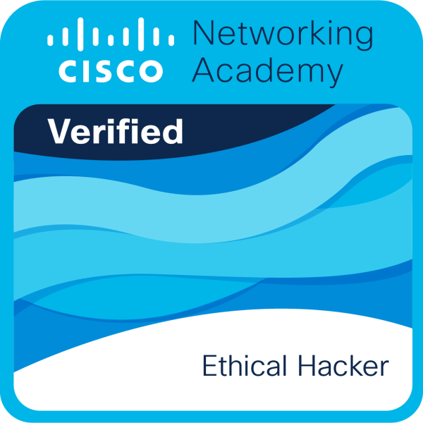

# 👋 Hi, I'm Ahmed Elghachi

---
## 🛡️ About Me

Cybersecurity Master's student specializing in Cyber Defense and Information Systems, focused on Blue Team operations including threat detection, log analysis, and incident response. Hands-on experience with SOC environments, working with tools like Wazuh for monitoring and security event analysis. Skilled in SOC operations with AWS-based projects, including threat detection, log analysis, and incident response, as well as cloud security (AWS), network administration, and system hardening. Passionate about building practical security solutions, performing vulnerability assessments, and improving defensive security strategies.

---
## 📜 Certifications

  
  

---
